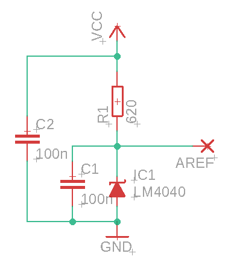

# 10GHz AD8317 RF power meter

## Features
* -55 to 0 dBm RF power measurement up to 10 GHz
* 2-point calibration (linear function), separate for each band
* Measuring `average`, `max` (peak) and `min` power.
* Ability to use an external RF attenuator
* Headless mode - control over serial only
* Display power in dBm, mW or W
* External attenuator support - 0..60 dB in 10 dB steps

## Parts

* Arduino Nano
* AD8317 power meter module
* SSD1306 128x32px OLED display
* LM4040 reference voltage (2.048 V)

## Assembly

* Build and flash Arduino software
* Build a voltage reference and connect it to `AREF` pin of Arduino, VCC (5V) and GND.

* Connect AD8317 module output to `A0` pin of Arduino, connect the grounds together. Provide 5V to the module.
* Connect OLED display to VCC, GND & SDA (`A4`), SCL (`A5`) Arduino pins.
* Connect buttons to pins D9 and D10. They should short pins to GND when pressed, internal pullup is used. GND is also available on D8.

## Calibration
* Power the meter while pressing a button
* "CALIB" should appear on the screen, raw ADC value will be displayed
* Select band and averaging, as well as current generator level (-40 or -10 dBm by default)
* Select "SAVE" and click SET button to save the calibration value to EEPROM
* To make sure the calibration has been saved correctly, open serial port (115200 bps) and send "p" letter to the meter
* Table with raw calibration values will be printed via serial terminal

## TODO
* Add buttons [done]
* Show power also in mW/W [done]
